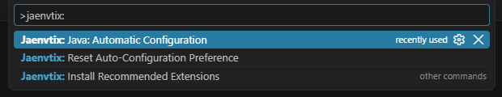
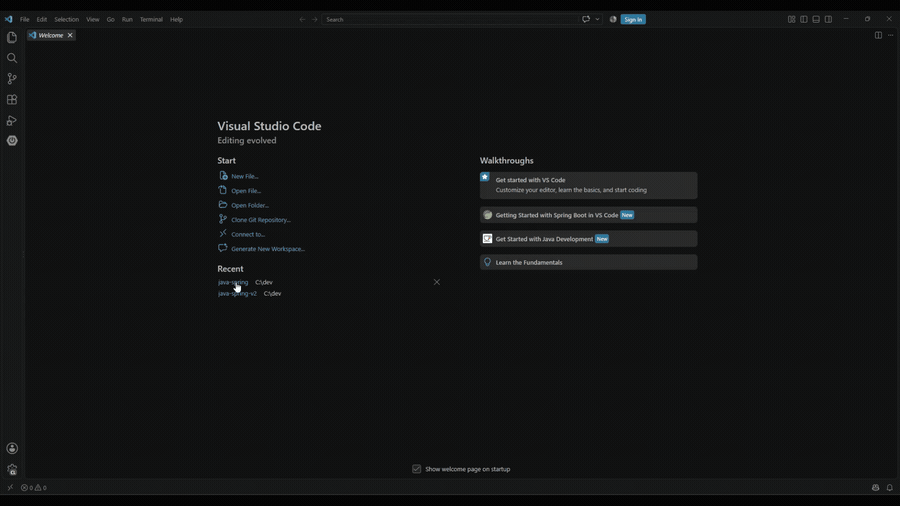
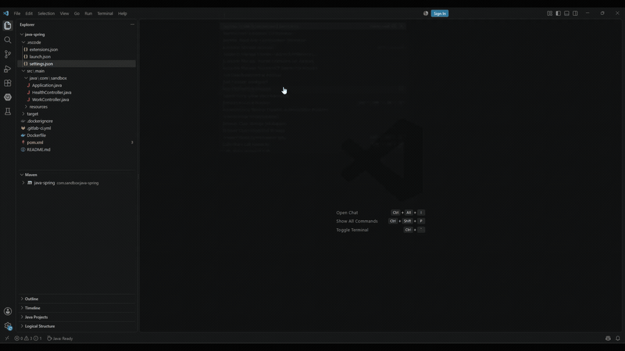
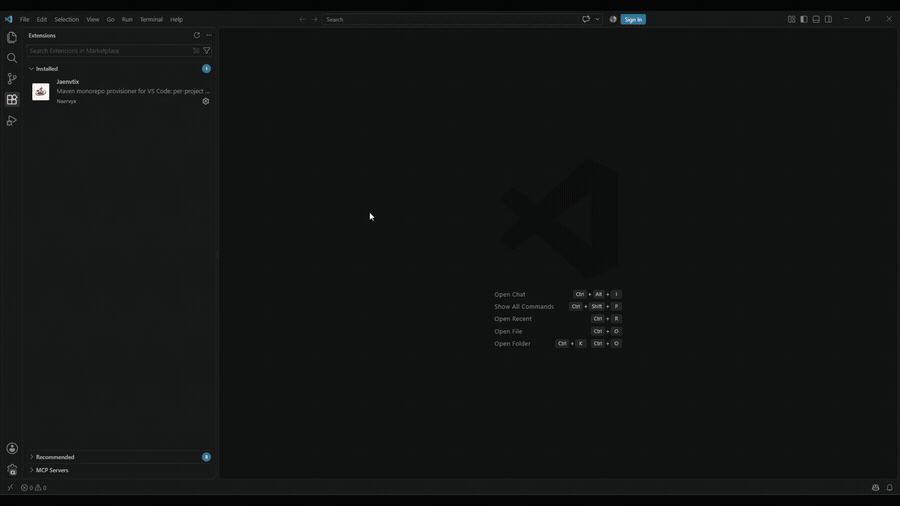

# Jaenvtix

[](https://marketplace.visualstudio.com/items?itemName=naervyx.jaenvtix)
[](https://marketplace.visualstudio.com/items?itemName=naervyx.jaenvtix)
[](https://open-vsx.org/extension/Naervyx/jaenvtix)
[](https://open-vsx.org/extension/Naervyx/jaenvtix)
[](https://code.visualstudio.com/)
[](LICENSE.md)

Jaenvtix configures Java and Maven workspaces in VS Code. It reads every `pom.xml` it finds,
resolves the Java version each project needs, reuses a JDK you already have installed (or
downloads a matching one), and writes that project's `.vscode/settings.json` so the project is
ready to build. If you move between services that target different Java versions, including
across multi-root workspaces, you stop editing `JAVA_HOME` by hand.

Jaenvtix is a provisioner, not a language server. It fills in the settings the official Red Hat
and Microsoft Java extensions read, defers to a project's `mvnw` when there is one, and leaves
alone whatever those extensions already get right.

## The three commands



### Java: Automatic Configuration

Runs the whole pipeline. It also runs on its own when you answer Yes to the activation prompt,
which is the only thing Jaenvtix does before you agree to anything. When Java language support is
missing the prompt offers to install it first and configures only once that succeeds. The progress
notification names the step it is on, including the wait for the Red Hat language server to finish
loading.



Running it again reuses everything already provisioned. Change detection means a re-run with
nothing to do writes nothing, skips the language server wait, and finishes in seconds.



What the run writes, and what it leaves untouched, is in [Settings written per
project](#settings-written-per-project) and the sections after it.

### Install Recommended Extensions

Opt-in, and never runs on its own. It offers the companion extensions in a multi-select list,
ignores the ones you already have, and installs only what you pick.



### Reset Auto-Configuration Preference

Clears the answer in every workspace at once, not only the one in front of you. It bumps a global
generation counter that each answer is stamped with, so older answers stop counting and the prompt
comes back the next time you open a workspace with a `pom.xml`.

## Quick start

1. Install the extension, for example with `code --install-extension jaenvtix-<version>.vsix`.
2. Open a workspace (single folder or multi-root) that contains at least one Maven project.
3. Jaenvtix activates on `pom.xml` and asks: Yes or No. Yes configures this workspace. No does
   nothing, now or later, for this workspace.
4. Without Java language support installed the question becomes Install and Configure, or No.
   Jaenvtix offers the Extension Pack for Java first and configures only once it is there, because
   everything it writes is read by those extensions.

Once a workspace is configured, reopening it is silent. If the configuration goes missing, say
because `.vscode` was deleted or never committed, the question comes back on the next open. A No is
respected either way. `Jaenvtix: Reset Auto-Configuration Preference` clears the answers everywhere
and asks again from scratch. You can run `Jaenvtix: Java: Automatic Configuration` manually at any
time, and `Jaenvtix: Install Recommended Extensions` if you are new to Java on VS Code.

## What it will and will not touch

Jaenvtix asks before its first run in a workspace and never edits your User Settings until you
answer. It installs nothing without being asked and configures nothing it cannot make work: when
Java language support is missing it offers to install it and stops if that does not happen, rather
than reporting success over a workspace where nothing works. Every writer merges rather than overwrites: entries you wrote in `settings.json`,
`~/.m2/toolchains.xml` and `java.configuration.runtimes` survive verbatim, and the `default` flag
on a runtime is yours to set. Broken runtime paths are repaired where possible (a path pointing
at `bin/` instead of the JDK root, say) and are removed only when repair fails and the JDK is
gone. Writers do change detection, so a re-run that has nothing to do writes nothing.

Downloads go to `~/.jaenvtix/`, toolchains to `~/.m2/`, settings to each project's `.vscode/`.
JDKs installed anywhere else are read but never modified.

## How JDKs are resolved

Jaenvtix reuses an installed JDK when it can. Discovery covers `JAVA_HOME`, `JDK_HOME`, `PATH`,
SDKMAN, jEnv, jabba, asdf, gradle and jbang through
[`jdk-utils`](https://www.npmjs.com/package/jdk-utils) (the same library Red Hat uses), plus
Chocolatey and Homebrew install directories, plus any JDK registered in `~/.m2/toolchains.xml`.

Anything still missing is downloaded to `~/.jaenvtix/jdk-<version>/`, following
`jaenvtix.preferredJdkVendor`. The default `auto` tries Oracle for LTS 21+, then Corretto, then
Temurin, with Microsoft and Liberica covering platforms the others do not build for. You can pin
Oracle, Temurin, Corretto, Liberica, Microsoft, Zulu or Semeru instead; every candidate URL is
probed first, so an unavailable vendor falls back to the next one.

The set of supported Java versions comes from the Red Hat Java Language Server at runtime, so a
new LTS works the day Red Hat supports it, without a Jaenvtix release.

At most once every 24 hours, Jaenvtix asks the vendor metadata API whether a cached JDK has a
newer patch and refreshes the cache slot if so. This covers Temurin, Corretto, Liberica, Zulu and
Semeru, the vendors with a public API. Turn it off with `jaenvtix.autoUpdatePatches`.

Downloads retry on timeouts, connection resets, 5xx and 429 with exponential backoff (1s, 2s,
4s), configurable via `jaenvtix.downloadMaxRetries`. Permanent failures such as 404 or DNS errors
fail immediately.

Supported platforms: Windows x64 and ARM64 (Surface Pro X, Copilot+ PCs); macOS Intel and Apple
Silicon; Linux glibc x64 and ARM64; Linux musl x64 and ARM64, so Alpine devcontainers get
musl-native builds from Temurin `alpine-linux` or Liberica.

## How Maven is resolved

Maven is downloaded into `~/.jaenvtix/jdk-<version>/mvn-custom/` only when at least one project
in the workspace neither ships `mvnw` nor pins its own Maven version. A workspace where every
project uses `mvnw` skips this entirely.

Inside each provisioned Maven's `bin/`, Jaenvtix generates a wrapper (`jaenvtix-mvn`, or
`jaenvtix-mvn.cmd` on Windows) that pins `JAVA_HOME`, `MAVEN_HOME` and `PATH` and passes
`-s ~/.m2/settings.xml -Dmaven.repo.local=~/.m2/repository` before calling Maven. It behaves the
same from a plain PowerShell prompt or a CI shell, where the stock `mvn.cmd` would pick up
whatever `JAVA_HOME` happens to be set.

`~/.m2/toolchains.xml` gets one `<toolchain>` entry per JDK, merged into whatever is already
there, so projects using `maven-toolchains-plugin` find a matching JDK without extra setup.

## Settings written per project

When a project does not ship `mvnw`:

| Setting | Value |
| --- | --- |
| `maven.executable.path` | path to the Jaenvtix wrapper for the matching JDK and Maven |
| `maven.executable.preferMavenWrapper` | `false`, so vscode-maven uses the explicit path |
| `maven.terminal.customEnv` | per-folder `JAVA_HOME` / `MAVEN_HOME` / `M2_HOME` / `PATH` |
| `terminal.integrated.env.{windows,linux,osx}` | the same env, for every terminal opened in the folder |
| `java.jdt.ls.java.home` (Java 21+) or `java.configuration.runtimes` (Java < 21) | the matching JDK; folder runtimes are merged, and entries you authored or repointed win |
| `java.configuration.maven.userSettings` | `~/.m2/settings.xml` |
| `java.compile.nullAnalysis.mode` | `automatic`, seeded once; change it and Jaenvtix leaves it alone |
| `java.configuration.updateBuildConfiguration` | `automatic`, seeded once, same rule |
| `maven.terminal.favorites` | `clean install -DskipTests`, plus `spring-boot:run` for Spring Boot apps, seeded once |

The Maven favorites show up in the Maven explorer the way run configurations do in IntelliJ, and
they are yours to edit afterwards. If a terminal-affecting setting changed while you had
terminals open, Jaenvtix tells you to reopen them, since VS Code only applies the new environment
to new terminals.

When a project does ship `mvnw` (Spring Boot, Quarkus and friends), Jaenvtix stays out of the
way: `maven.executable.path` is omitted so vscode-maven invokes the in-project wrapper,
`maven.executable.preferMavenWrapper` is omitted because its default is already `true`, and
`maven.terminal.customEnv` is omitted as redundant with `terminal.integrated.env.*`. The language
server settings are still written, since they help Red Hat resolve types no matter how the build
is launched.

Jaenvtix also seeds its own `jaenvtix.*` keys with their defaults into the workspace
`.vscode/settings.json`, so you can change one inline with VS Code autocomplete instead of
hunting for it.

## Settings written per workspace or user

`java.configuration.runtimes` in User Settings gets one entry per JDK in the Jaenvtix cache,
merged with what is already there. Invalid entries are repaired when `jaenvtix.enableRuntimePathFix`
allows it and dropped only as a last resort.

A few Java tunings are written to User Settings on first run, each only if you have not set it
yourself: `java.debug.settings.hotCodeReplace: "auto"` (a no-op unless auto-build is on),
`maxConcurrentBuilds` matching your core count, hierarchical package presentation, an
organize-imports threshold, and the JUnit UTF-8 fix on Windows. `jaenvtix.applyJavaTunings` opts
out.

When Spring Boot Tools is installed and a Java 21+ JDK is provisioned, `spring-boot.ls.java.home`
points at it, which is what keeps the Spring language server from crashing on the wrong JDK. When
the Spring Initializr extension is installed, `spring.initializr.defaultJavaVersion` is seeded
with the best provisioned LTS (17 or newer), so generated projects start at a level your machine
can build. Neither overwrites a value you set; `jaenvtix.configureOptionalExtensions` opts out.

The recommended-extensions catalog is merged into the workspace root's
`.vscode/extensions.json`, leaving your entries and `unwantedRecommendations` untouched, so VS
Code suggests the companion extensions to anyone who opens the repo. Spring Boot Dashboard is
added only when a Spring Boot app was detected.

## Verification after a run

For projects whose settings actually changed, Jaenvtix waits for the Red Hat language server to
report `serverReady` (a labelled phase in the progress notification), then calls
`java.projectConfiguration.update` per changed `pom.xml` so the new runtime mapping is picked up
without reloading the window.

It then reads back the Java level the server resolved for each project, skipping aggregator poms
with no `src/main/java`. A project still compiling at the old level produces one informational
toast with a Restart Language Server action, since restarting is how the server applies a new
`java.jdt.ls.java.home`. The project stays flagged and is re-checked on the next run until it
resolves. If the server is still loading when the 15 second budget runs out, the refresh and the
check run as soon as it becomes ready rather than reporting stale state. Runs that changed
nothing skip all of this, so reopening a large workspace stays fast.

## Maven monorepos

When a parent pom declares `<java.version>` and its modules do not, each module inherits the
parent's version, the way Spring Boot monorepos are usually laid out. Inheritance only walks
ancestors that are themselves part of the workspace, so opening a single module without its
parent still resolves to something sensible. Multi-module workspaces also get
`maven.view: "hierarchical"` so the Maven panel mirrors the module tree.

Projects that need different Maven versions get different Maven installs. A legacy module pinned
to 3.6 through `<prerequisites><maven>` and a modern one declaring
`<properties><maven.version>3.9.5</maven.version>` are downloaded independently, and each
project's `.vscode/settings.json` points at its own:

```
~/.jaenvtix/jdk-21/
├── mvn-3.6.3/
│   └── bin/jaenvtix-mvn
├── mvn-3.9.5/
│   └── bin/jaenvtix-mvn
└── mvn-custom/  (default when the pom pins no Maven version)
    └── bin/jaenvtix-mvn
```

Each wrapper pins its own Maven, JDK and environment. Set
`jaenvtix.isolatedMavenPerProject: false` if you would rather share one Maven.

## Working with the official Java extensions

The recommended baseline is Microsoft's
[Extension Pack for Java](https://marketplace.visualstudio.com/items?itemName=vscjava.vscode-java-pack).
Jaenvtix populates the settings each extension reads:

| Extension | What it does | What Jaenvtix feeds it |
| --- | --- | --- |
| **Language Support for Java™ by Red Hat** (`redhat.java`) | compiler, IntelliSense and refactoring via Eclipse JDT-LS | `java.configuration.runtimes`, `java.jdt.ls.java.home`, `java.configuration.maven.userSettings` |
| **Maven for Java** (`vscjava.vscode-maven`) | Maven explorer, goal execution | `maven.executable.path` (when there is no `mvnw`), `maven.executable.preferMavenWrapper`, `maven.terminal.favorites`, `maven.view`, `terminal.integrated.env.*` |
| **Project Manager for Java** (`vscjava.vscode-java-dependency`) | project tree, dependency view | `java.dependency.packagePresentation`; the rest comes from Red Hat |
| **Debugger for Java**, **Test Runner for Java** | run, debug, JUnit | launch configurations, `hotCodeReplace`, the `java.test.config` UTF-8 fix on Windows |
| **Spring Boot Tools** (`vmware.vscode-spring-boot`) | Spring language server, live data | `spring-boot.ls.java.home` (a provisioned Java 21+ JDK) |
| **Spring Initializr** (`vscjava.vscode-spring-initializr`) | project generation from start.spring.io | `spring.initializr.defaultJavaVersion` (best provisioned LTS) |

Without the pack the per-folder settings are still written, but the language server and build
features only appear once the Red Hat extension is installed.

A few things follow from this without any extra configuration. The `debugjava` command that
Debugger for Java adds to the terminal inherits the per-folder `JAVA_HOME` and `PATH`, so it
debugs with the project's JDK. Spring Tools validates its JVM at startup through
`spring-boot.ls.checkJVM`, and that check passes because it was handed a valid Java 21+ home.
Project Manager's Dependency Checkup reports known vulnerabilities in your runtime; the 24 hour
patch refresh is what clears them. Generating a project with Spring Initializr writes a `pom.xml`,
which triggers Jaenvtix, which resolves the JDK, wires Maven and creates the
`Jaenvtix: Spring Boot (…)` launch configurations that Spring Boot Dashboard then lists.

`Jaenvtix: Install Recommended Extensions` offers XML, Spring Boot Extension Pack and Extension
Pack for Java in a multi-select QuickPick, marking the ones you already have. Nothing is
installed unless you pick it, and this command is never run automatically.

## When not to use Jaenvtix

Gradle projects are out of scope; Jaenvtix only understands Maven. It configures the terminal
environment per folder, so if you want a JDK selector dropdown in the terminal, this is not it.
It always asks before its first run and never auto-installs companion extensions, so it is a poor
fit if you want everything set up without being asked. There is no explicit proxy or custom SSL
certificate support yet, only Node's defaults, which matters behind a corporate proxy; open an
issue if that blocks you.

If any of those is a dealbreaker,
[cypher256/java-extension-pack](https://github.com/cypher256/java-extension-pack) may suit you
better.

## Activation

Two activation events are declared, `workspaceContains:pom.xml` and
`workspaceContains:**/pom.xml`, and both on purpose. The host resolves the literal name with a
direct existence check on each workspace root, but sends the glob to the search service under a
7 second cancel budget that also honours `files.exclude`, `search.exclude` and `.gitignore`. With
only the glob, activation in a large or deeply nested repository is a race the extension can lose.

The prompt appears at most once per extension host lifetime, even in a multi-root workspace with
several `pom.xml` files firing the event repeatedly.

It follows the state of the project, not your answer history. A workspace with a `pom.xml` and no
Jaenvtix configuration gets asked even if you answered before, because a past Yes does not
configure anything today: delete `.vscode` and the question comes back. No is the exception and is
permanent for that workspace, configured or not, which is what stops the rule from asking on every
open of a project that deliberately keeps `.vscode` out of the repository. Running the command from
the Command Palette still works if you change your mind, and counts as a Yes.

Whether a workspace counts as configured is answered from the `settings.json` files the last
successful run wrote, one per resolved project, recorded in `workspaceState`. A single missing file
makes the whole workspace unconfigured, which is what covers a monorepo that lost one module. A
workspace with no recorded list falls back to looking for a `jaenvtix.*` key in each folder root's
`settings.json`.

There is no global preference and no silent mode: every workspace answers for itself.
`Jaenvtix: Reset Auto-Configuration Preference` clears every workspace at once by bumping a global
generation counter that each answer carries, so older answers stop counting. Closing the prompt
with the X persists nothing, and neither does a run that fails or stops early, since nothing was
configured.

While the Red Hat Java extension is missing the workspace is offered Install and Configure, or No,
rather than being skipped quietly. `Jaenvtix: Java: Automatic Configuration` from the palette
configures anyway, for anyone who wants the provisioning without the editor integration.

One known limit: a module added to an already-configured monorepo is not detected, because every
recorded file still exists. Run the command from the palette after adding one. Detecting it would
mean scanning for `pom.xml` on every activation, which is the cost the activation events above
exist to avoid.

## Local layout

File names below use the Unix convention; on Windows the binaries gain `.exe` or `.cmd` suffixes.

```
~/.jaenvtix/
├── jdk-17/                            ← downloaded only if no installed JDK 17 was reused
│   ├── .jaenvtix-version.json         ← exact version + vendor, drives the 24h patch check
│   ├── bin/
│   │   └── java                       ← JDK launcher
│   ├── mvn-custom/                    ← absent when every project uses mvnw
│   │   └── bin/
│   │       ├── mvn                    ← stock Maven launcher
│   │       └── jaenvtix-mvn           ← wrapper (pins JAVA_HOME, forces -s / -Dmaven.repo.local)
│   └── mvn-3.9.5/                     ← only when a project pins Maven 3.9.5
├── jdk-21/ ...
└── temp/                              ← download staging; cleared after extraction

~/.m2/
└── toolchains.xml                     ← merged with one <toolchain> per JDK
```

## Commands

| Command ID                                  | Title                                              |
| ------------------------------------------- | -------------------------------------------------- |
| `jaenvtix.configureJava`                    | `Jaenvtix: Java: Automatic Configuration`          |
| `jaenvtix.resetAutoConfigPreference`        | `Jaenvtix: Reset Auto-Configuration Preference`    |
| `jaenvtix.installRecommendedExtensions`     | `Jaenvtix: Install Recommended Extensions`         |

## Settings

Everything lives under `jaenvtix.*` and has a default; nothing is required.

| Setting | Default | What it does |
| --- | --- | --- |
| `jaenvtix.preferredJdkVendor` | `"auto"` | Preferred vendor for downloads: `auto`, `oracle`, `temurin`, `corretto`, `liberica`, `microsoft`, `zulu`, `semeru`. Falls back automatically when unavailable. |
| `jaenvtix.applyJavaTunings` | `true` | Write the Java tunings (hotCodeReplace, maxConcurrentBuilds, JUnit UTF-8 on Windows and the rest) to User Settings on first run. |
| `jaenvtix.configureOptionalExtensions` | `true` | Point detected companion extensions such as Spring Boot Tools at the right JDK. |
| `jaenvtix.discoverFromToolchainsXml` | `true` | Read `~/.m2/toolchains.xml` as a JDK discovery source. |
| `jaenvtix.enableRuntimePathFix` | `true` | Try to repair an invalid `java.configuration.runtimes` path before removing the entry. |
| `jaenvtix.autoUpdatePatches` | `true` | Check every 24h for newer patches of cached JDKs and re-download them. |
| `jaenvtix.downloadMaxRetries` | `3` | Retries for transient download failures; `0` disables them. |
| `jaenvtix.isolatedMavenPerProject` | `true` | Provision one Maven per version pinned in a project's pom. |

## Dependencies

The only runtime dependency is [`jdk-utils`](https://www.npmjs.com/package/jdk-utils), used for
JDK detection across `JAVA_HOME`, `PATH`, SDKMAN, jEnv, jabba, asdf, gradle and jbang.

The [Extension Pack for Java](https://marketplace.visualstudio.com/items?itemName=vscjava.vscode-java-pack)
is recommended but not bundled; install it yourself or run
`Jaenvtix: Install Recommended Extensions`.

## Contributing

```bash
bun install
bun run compile    # or: bun run watch
bun run test       # 530+ unit tests
bun run lint
bun run package    # produces a .vsix for local install
```

Press `F5` in VS Code to launch an Extension Development Host.

## License

Eclipse Public License v2.0, see [LICENSE.md](LICENSE.md).
